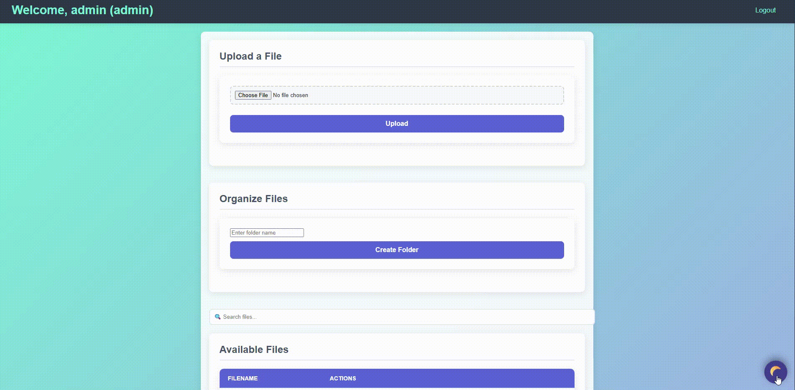

# 📂 File-Sharing App

**A sleek, secure, and modern file-sharing web application built with Flask.**
Drag-and-drop uploads, live previews, role-based access, activity logging, and responsive design.


## ✨ Features

* 🚀 **Fast Uploads** – Drag & drop multiple files at once
* 🔒 **Role-Based Access** – Admins, editors, and viewers with controlled permissions
* 👁️ **File Preview** – Images, PDFs, and text files viewable right in the browser
* 🔍 **Instant Search** – Find files instantly with smart filtering
* 🌙 **Dark / Light Mode** – Switch seamlessly between themes
* 📱 **Responsive** – Works on desktop, tablet, and mobile


## 🖼️ Screenshots

| Upload & Preview         | Dark Mode             |
| ------------------------ | ----------------------|
|  | | 


## ⚙️ Getting Started

### Prerequisites

* Python 3.8+
* pip (package manager)

### Installation

```bash
git clone https://github.com/CyberDroid456/File-Sharing-app-.git
cd File-Sharing-app-
pip install -r requirements.txt
python app.py
```

Now open [http://localhost:5000](http://localhost:5000) in your browser.


## 🚀 Deployment

* **Local (ngrok)**:

```bash
ngrok http 5000
```

* **Cloud (Render, Railway, Heroku)**: Coming soon in roadmap


## 🛡️ Security

* Encrypted file handling
* Role-based access control
* Configurable settings in `config.py`


## 📅 Roadmap

* [ ] Sharable links
* [ ] Cloud deployment guide
* [ ] Link expiry + password-protected links
* [ ] End-to-end encryption
* [ ] QR code sharing
* [ ] Mobile-friendly PWA support


## 🤝 Contributing

Contributions welcome! Open an issue, suggest features, or submit a pull request.


## 📜 License

MIT License © 2025 [CyberDroid456](https://github.com/CyberDroid456)


